# Gap Analysis Part 2 (Seasonal maps)

This document includes Python codes that conduct kernel density analysis and standard error prediction on water quality parameters **with seasonality**, including Total Nitrogen, Salinity, Dissolved Oxygen, Turbidity, and Secchi Depth.

The analysis is conducted in the separate managed areas of Charlotte Harbor, Estero Bay, Big Bend, Biscayne Bay, and Guana Tolomato.

Tasks:  


1. Create Kernel Density Maps for both continuous and discrete data points.  
    - For data, without seasonality (Part 1):
        * Get all data from 2015 to 2019.  
        * Create shapefiles for each managed area and water parameters.    
        * Using Arcpy Kernel Density to create maps (KDE_Arcpy in arcgispro-py3 environment).<br><br>
    - **For data, with seasonality (Part 2):**  
        * Get all data from 2015 to 2019.  
        * Assign season according to season table.
        * Extract different four seasons, generate shapefiles in four folders.
        * Use the previously defined Generate Kernel Density method (Arcpy) to generate maps.
        * Add a season suffix to distinguish the generated .shp season files, and save them to one folder. <br><br>
    - Show KDE and SEP maps w/o seasons in pairs. <br><br>  
2. Calculate the average of rescaled SEP rasters in each managed area and parameter.  
    - For data, without seasonality (Part 1):  
        * Rescale the SEP raster from data from 2015 to 2019.  
        * Calculate and Plot Average Rescaled SEP.<br><br>
    - **For data, with seasonality (Part 2):**  
        * Using the rescaled SEP from Part 1.
        * Calculate and plot average rescaled SEP by season.<br><br>  
    - Show KDE and SEP maps w/o seasons in pairs.<br><br>

**Part 2 Tasks**
* [1.Data Preprocess](#preprocessing)
    * [1.1 Preset Parameters](#preset)
    * [1.2 Assign Season](#reg_as_season)
* [2. Create Shapefile](#reg_create_shp)
    * [2.1 Create Shapefiles for Winter](#reg_create_shp_winter)
    * [2.2 Create Shapefiles for Spring](#reg_create_shp_spring)
    * [2.3 Create Shapefiles for Summer](#reg_create_shp_summer)
    * [2.4 Create Shapefiles for Fall](#reg_create_shp_fall)
* [3. Calculate Average Rescaled SEP by Season](#reg_calculate_average_season)
    * [3.1 Charlotte Harbor](#reg_avg_rescale_sep_season_ch)
    * [3.2 Estero Bay](#reg_avg_rescale_sep_season_eb)
    * [3.3 Big Bend](#reg_avg_rescale_sep_season_bb)
    * [3.4 Biscayne Bay Aquatic Preserve](#reg_avg_rescale_sep_season_bbay)
    * [3.5 Guana Tolomato](#reg_avg_rescale_sep_season_gtm)
* [4. Plot Kernel Density Map & Standard Error Prediction Map (Season)](#reg_kde_sep)
    * [4.1 Charlotte Harbor](#reg_plot_pair_ch)
    * [4.2 Estero Bay](#reg_plot_pair_eb)
    * [4.3 Big Bend](#reg_plot_pair_bb)
    * [4.4 Biscayne Bay Aquatic Preserve](#reg_plot_pair_bbay)
    * [4.5 Guana Tolomato](#reg_plot_pair_gtm)


```python
import pandas as pd
import geopandas as gpd
import os
from collections import defaultdict
import rasterio
import numpy as np
import warnings
warnings.filterwarnings('ignore')
import numpy.ma as ma
import matplotlib.pyplot as plt
import contextily as cx
from mpl_toolkits.axes_grid1 import make_axes_locatable
import rasterio.plot
from shapely.geometry import Point
import shutil
import glob
import matplotlib.gridspec as gridspec
import importlib

import sys
sys.path.insert(0, '/Users/cong/Downloads/WaterQualityProject/SEACAR_WQ_Pilot-selected/git/misc')
import GapAnalysis
warnings.filterwarnings(action='once')
importlib.reload(GapAnalysis) # reload the GapAnalysis module after edit
```


    <module 'GapAnalysis' from '/Users/cong/Downloads/WaterQualityProject/SEACAR_WQ_Pilot-selected/git/misc/GapAnalysis.py'>


# 1. Data Preprocessing <a class="anchor" id="preprocessing"></a>
Define the water quality parameter folders


```python
# For kernel density estimation
gis_path = '/Users/cong/Downloads/WaterQualityProject/SEACAR_WQ_Pilot-selected/GIS_data/'
dfAll_orig = pd.read_csv(gis_path + r"all_0214.csv", low_memory=False)

season_table = pd.read_csv(gis_path + r"OEATUSF_Geospatial_TempSeasons_update_0611.csv", low_memory=False)
boundary = gpd.read_file(gis_path + r"ORCP_Managed_Areas_Oct2021.shp")


# All shapefile folder for each season
gap_path = gis_path +'Gap_analysis/'

# Water quality data with assiged season attribute
dfAll_orig_season = gap_path + r'WQ_Season.csv'

shp_winter = gap_path + r"Gap_SHP_Winter"
shp_spring = gap_path + r"Gap_SHP_Spring"
shp_summer = gap_path + r"Gap_SHP_Summer"
shp_fall = gap_path + r"Gap_SHP_Fall"
shp_all = gap_path + r"Gap_SHP_All_Seasons"

# All KDE maps folder for each season generated by Arcpy KDE function

kde_seasons = gap_path + r'Gap_KDE_Each_Season/'
kde_winter = kde_seasons + r"Gap_KDE_Winter"
kde_spring = kde_seasons + r"Gap_KDE_Spring"
kde_summer = kde_seasons + r"Gap_KDE_Summer"
kde_fall = kde_seasons + r"Gap_KDE_Fall"

# All kde maps with seasonality
kde_all = gap_path + r"Gap_KDE_AllSeasons"

# Store both KDE and SEP maps
kde_sep_files_season = gap_path + r"KDE_SEP_TIF_Season"
```


```python
# For standard error prediction

eps_path = gap_path + 'standard_error_prediction/'
rescale_path_GSCHAP = eps_path + r"Rescaled_CharlotteHarbor"
rescale_path_EBAP = eps_path + r"Rescaled_EsteroBay"
rescale_path_BBSAP = eps_path + r"Rescaled_BigBend"
rescale_path_BBAP = eps_path + r"Rescaled_BiscayneBay"
rescale_path_GTMNERR = eps_path + r"Rescaled_GTMReserve"

boundary_path = gis_path + r"ORCP_Managed_Areas_Oct2021.shp"

#Store average tif files in Charlotte Harbor by seasons
avg_tif_GSCHAP_Season = eps_path + r"AVG_SEP_GSCHAP_Season"
avg_tif_EBAP_Season = eps_path + r"AVG_SEP_EBAP_Season"
avg_tif_BBSAP_Season = eps_path + r"AVG_SEP_BBSAP_Season"
avg_tif_BBAP_Season = eps_path + r"AVG_SEP_BBAP_Season"
avg_tif_GTMNERR_Season = eps_path + r"AVG_SEP_GTMNERR_Season"
```


```python
# Select the year between 2015 to 2019 and needed  managed areas
managed_areas = [
    'Gasparilla Sound-Charlotte Harbor Aquatic Preserve',
    'Estero Bay Aquatic Preserve',
    'Big Bend Seagrasses Aquatic Preserve',
    'Biscayne Bay Aquatic Preserve',
    'Guana Tolomato Matanzas National Estuarine Research Reserve'
]

selected_dfAll_orig = dfAll_orig[(dfAll_orig['Year'] >= 2015) & 
                                 (dfAll_orig['Year'] <= 2019) & 
                                 (dfAll_orig['ManagedAreaName'].isin(managed_areas))]
```

## 1.2 Assign Season <a class="anchor" id="reg_as_season"></a>


```python
# GapAnalysis.assign_season(selected_dfAll_orig, selected_season_table, dfAll_orig_season)
```


```python
selected_dfAll_orig_season = pd.read_csv(dfAll_orig_season)
selected_dfAll_orig_season.head()
```

Select the data for the four seasons


```python
selected_dfAll_orig_winter = selected_dfAll_orig_season[(selected_dfAll_orig_season['season'] =='Winter')]

selected_dfAll_orig_spring = selected_dfAll_orig_season[(selected_dfAll_orig_season['season'] =='Spring')]

selected_dfAll_orig_summer = selected_dfAll_orig_season[(selected_dfAll_orig_season['season'] =='Summer')]

selected_dfAll_orig_fall = selected_dfAll_orig_season[(selected_dfAll_orig_season['season'] =='Fall')]
```

# 2. Create Shapefile <a class="anchor" id="reg_create_shp"></a>


```python
managed_area_names = [
    'Gasparilla Sound-Charlotte Harbor Aquatic Preserve',
    'Estero Bay Aquatic Preserve',
    'Big Bend Seagrasses Aquatic Preserve',
    'Biscayne Bay Aquatic Preserve',
    'Guana Tolomato Matanzas National Estuarine Research Reserve'
]

parameter_names = ['Salinity', 'Total Nitrogen', 'Dissolved Oxygen', 'Turbidity', 'Secchi Depth']
```

## 2.1 Create Shapefiles for Winter<a class="anchor" id="reg_create_shp_winter"></a>


```python
GapAnalysis.delete_all_files(shp_winter)
```


```python
# Create shapefiles for winter
GapAnalysis.create_shp_season(selected_dfAll_orig_winter, managed_area_names, parameter_names, shp_winter)
```

## 2.2 Create Shapefiles for Spring<a class="anchor" id="reg_create_shp_spring"></a>


```python
GapAnalysis.delete_all_files(shp_spring)
```


```python
# Create shapefiles for spring
GapAnalysis.create_shp_season(selected_dfAll_orig_spring, managed_area_names, parameter_names, shp_spring)
```

## 2.3 Create Shapefiles for Summer<a class="anchor" id="reg_create_shp_summer"></a>


```python
GapAnalysis.delete_all_files(shp_summer)
```


```python
# Create shapefiles for summer
GapAnalysis.create_shp_season(selected_dfAll_orig_summer, managed_area_names, parameter_names, shp_summer)
```

## 2.4 Create Shapefiles for Fall<a class="anchor" id="reg_create_shp_fall"></a>


```python
GapAnalysis.delete_all_files(shp_fall)
```


```python
# Create shapefiles for fall
GapAnalysis.create_shp_season(selected_dfAll_orig_fall, managed_area_names, parameter_names, shp_fall)
```

# 3. Calculate and Plot Average Rescaled SEP by Season <a class="anchor" id="reg_calculate_average_season"></a>

## 3.1 Charlotte Harbor <a class="anchor" id="reg_avg_rescale_sep_season_ch"></a>


```python
GapAnalysis.delete_all_files(avg_tif_GSCHAP_Season)
```


```python
GapAnalysis.calculate_average_tif_season(rescale_path_GSCHAP, avg_tif_GSCHAP_Season)
```

## 3.2 Estero Bay  <a class="anchor" id="reg_avg_rescale_sep_season_eb"></a>


```python
GapAnalysis.delete_all_files(avg_tif_EBAP_Season)
```


```python
GapAnalysis.calculate_average_tif_season(rescale_path_EBAP, avg_tif_EBAP_Season)
```

##  3.3 Big Bend <a class="anchor" id="reg_avg_rescale_sep_season_bb"></a>


```python
GapAnalysis.delete_all_files(avg_tif_BBSAP_Season)
```


```python
GapAnalysis.calculate_average_tif_season(rescale_path_BBSAP, avg_tif_BBSAP_Season)
```

## 3.4 Biscayne Bay <a class="anchor" id="reg_avg_rescale_sep_season_bbay"></a>


```python
GapAnalysis.delete_all_files(avg_tif_BBAP_Season)
```


```python
GapAnalysis.calculate_average_tif_season(rescale_path_BBAP, avg_tif_BBAP_Season)
```

## 3.5 Guana Tolomato <a class="anchor" id="reg_avg_rescale_sep_season_gtm"></a>


```python
GapAnalysis.delete_all_files(avg_tif_GTMNERR_Season)
```


```python
GapAnalysis.calculate_average_tif_season(rescale_path_GTMNERR, avg_tif_GTMNERR_Season)
```

# 4. Kernel Density Map & Standard Error Prediction Map (Season) <a class="anchor" id="reg_kde_sep"></a>

Function to merge all KDE and rescaled average SEP tif files into one folder to plot together


```python
folders = [kde_all, avg_tif_GSCHAP_Season, avg_tif_EBAP_Season, avg_tif_BBSAP_Season, avg_tif_BBAP_Season, avg_tif_GTMNERR_Season]
```


```python
GapAnalysis.delete_all_files(kde_sep_files_season)
```


```python
GapAnalysis.merge_folders(folders, kde_sep_files_season)
```

## 4.1 Charlotte Harbor <a class="anchor" id="reg_avg_rescale_sep_ch"></a>


```python
GapAnalysis.plot_pairs_season(kde_sep_files_season, 'Gasparilla Sound-Charlotte Harbor Aquatic Preserve', boundary, 50, 25)
```

    —————————————————————————————————————————————— Dissolved Oxygen ——————————————————————————————————————————————
    


    
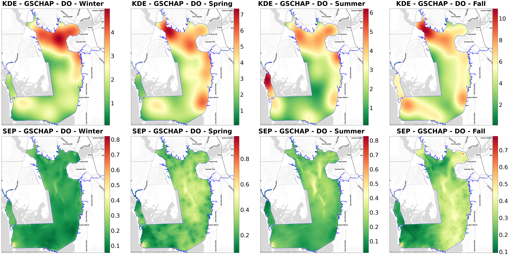
    


    —————————————————————————————————————————————————— Salinity ——————————————————————————————————————————————————
    


    
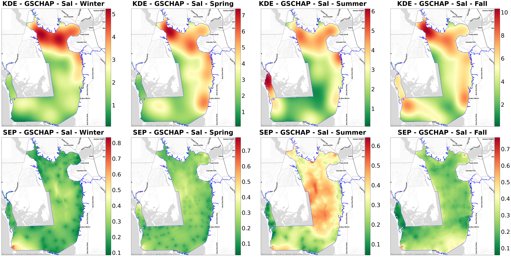
    


    ———————————————————————————————————————————————— Secchi Depth ————————————————————————————————————————————————
    


    
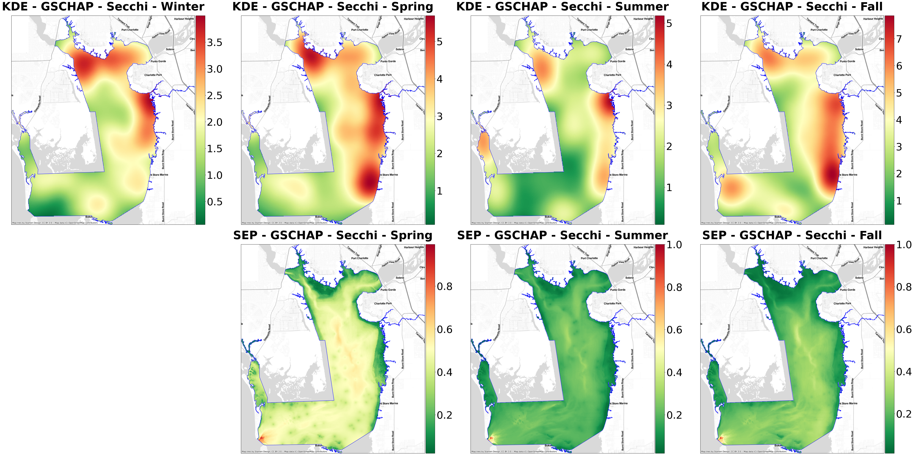
    


    ——————————————————————————————————————————————— Total Nitrogen ———————————————————————————————————————————————
    


    
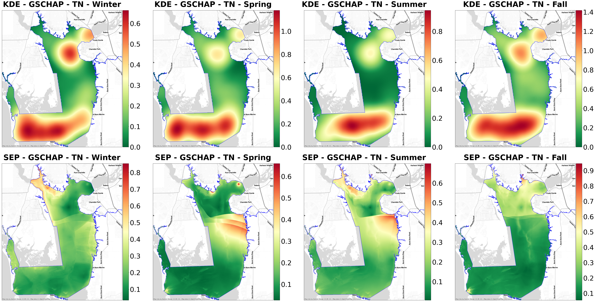
    


    ————————————————————————————————————————————————— Turbidity ——————————————————————————————————————————————————
    


    
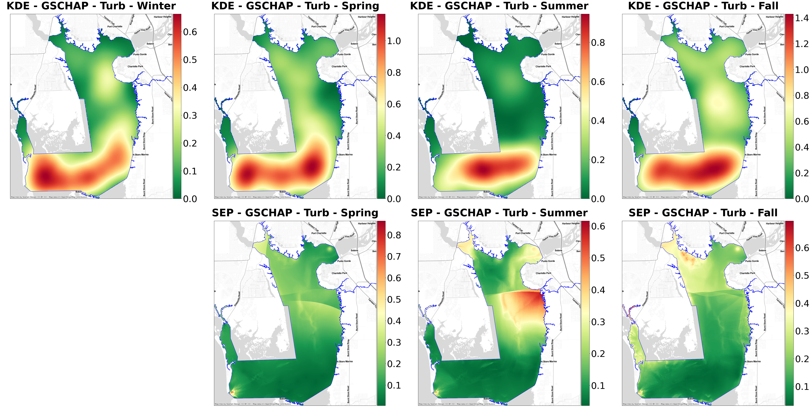
    


## 4.2 Estero Bay  <a class="anchor" id="reg_avg_rescale_sep_eb"></a>


```python
GapAnalysis.plot_pairs_season(kde_sep_files_season, 'Estero Bay Aquatic Preserve', boundary, 50, 25)
```

    —————————————————————————————————————————————— Dissolved Oxygen ——————————————————————————————————————————————
    


    
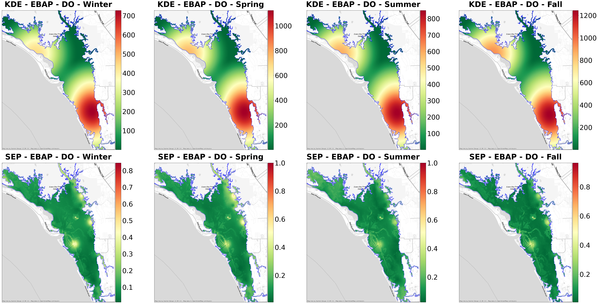
    


    —————————————————————————————————————————————————— Salinity ——————————————————————————————————————————————————
    


    
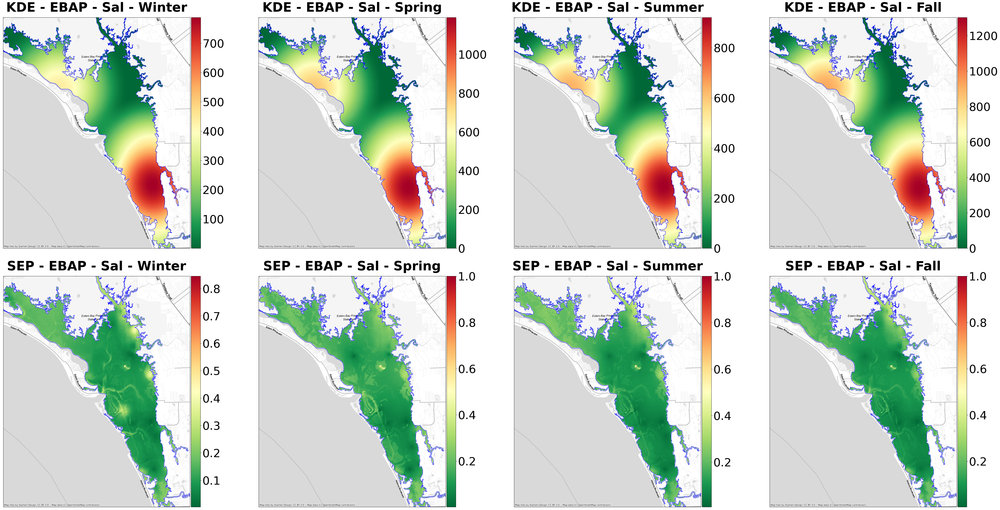
    


    ———————————————————————————————————————————————— Secchi Depth ————————————————————————————————————————————————
    


    
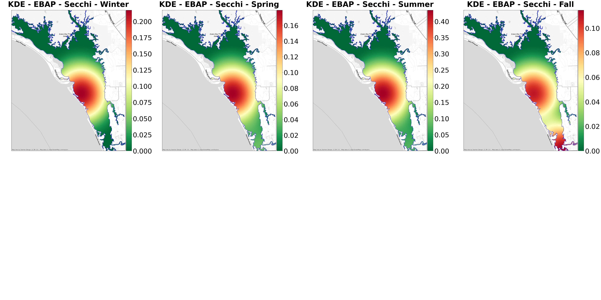
    


    ——————————————————————————————————————————————— Total Nitrogen ———————————————————————————————————————————————
    


    
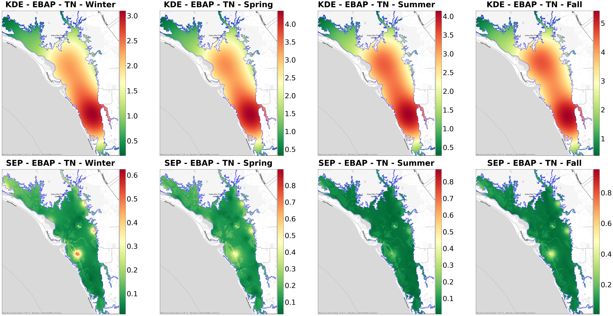
    


    ————————————————————————————————————————————————— Turbidity ——————————————————————————————————————————————————
    


    
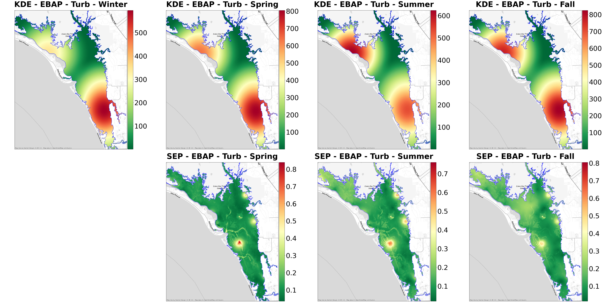
    


##  4.3 Big Bend <a class="anchor" id="reg_avg_rescale_sep_bb"></a>


```python
GapAnalysis.plot_pairs_season(kde_sep_files_season, 'Big Bend Seagrasses Aquatic Preserve', boundary, 65, 30)
```

    —————————————————————————————————————————————— Dissolved Oxygen ——————————————————————————————————————————————
    


    
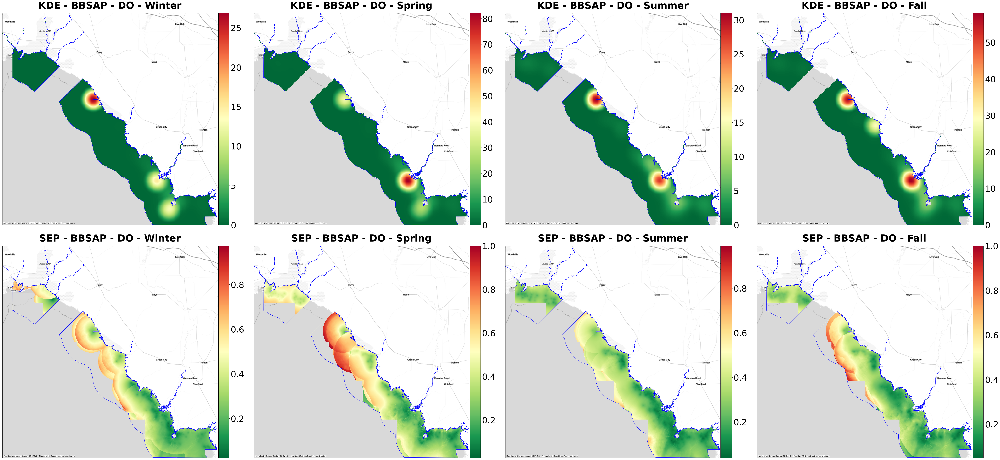
    


    —————————————————————————————————————————————————— Salinity ——————————————————————————————————————————————————
    


    
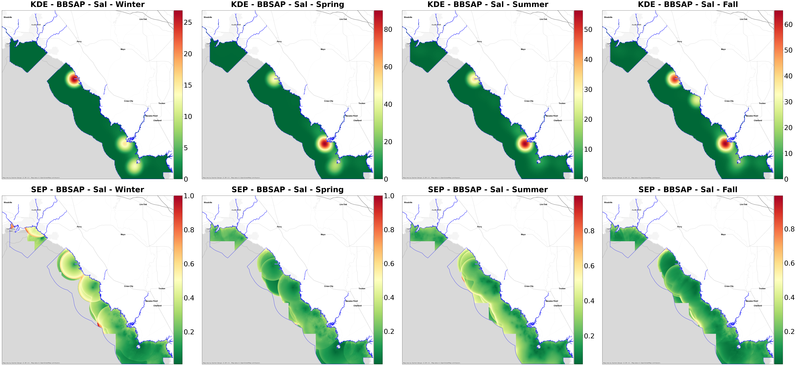
    


    ———————————————————————————————————————————————— Secchi Depth ————————————————————————————————————————————————
    


    
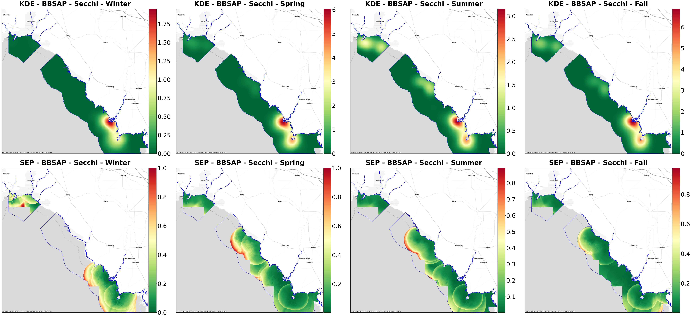
    


    ——————————————————————————————————————————————— Total Nitrogen ———————————————————————————————————————————————
    


    
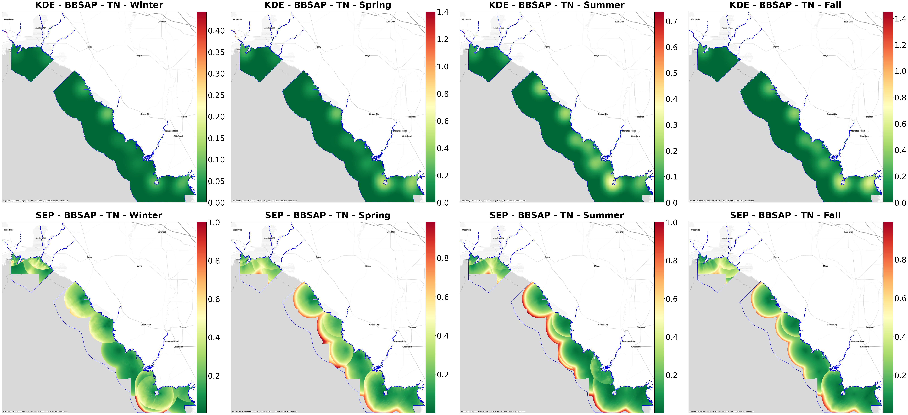
    


    ————————————————————————————————————————————————— Turbidity ——————————————————————————————————————————————————
    


    
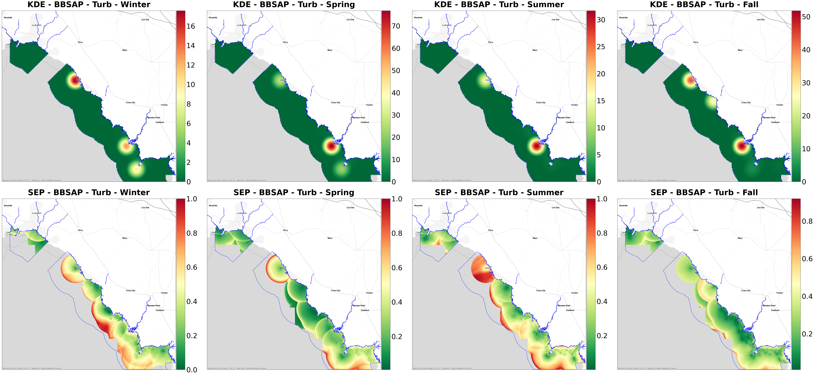
    


## 4.4 Biscayne Bay <a class="anchor" id="reg_plot_pair_bbay"></a>


```python
GapAnalysis.plot_pairs_season(kde_sep_files_season, 'Biscayne Bay Aquatic Preserve', boundary, 60, 70)
```

    —————————————————————————————————————————————— Dissolved Oxygen ——————————————————————————————————————————————
    


    

    


    —————————————————————————————————————————————————— Salinity ——————————————————————————————————————————————————
    


    

    


    ———————————————————————————————————————————————— Secchi Depth ————————————————————————————————————————————————
    


    

    


    ——————————————————————————————————————————————— Total Nitrogen ———————————————————————————————————————————————
    


    

    


    ————————————————————————————————————————————————— Turbidity ——————————————————————————————————————————————————
    


    

    


## 4.5 Guana Tolomato <a class="anchor" id="reg_plot_pair_gtm"></a>


```python
GapAnalysis.plot_pairs_season(kde_sep_files_season, 'Guana Tolomato Matanzas National Estuarine Research Reserve', boundary, 60, 70)
```

    —————————————————————————————————————————————— Dissolved Oxygen ——————————————————————————————————————————————
    


    

    


    —————————————————————————————————————————————————— Salinity ——————————————————————————————————————————————————
    


    

    


    ———————————————————————————————————————————————— Secchi Depth ————————————————————————————————————————————————
    


    
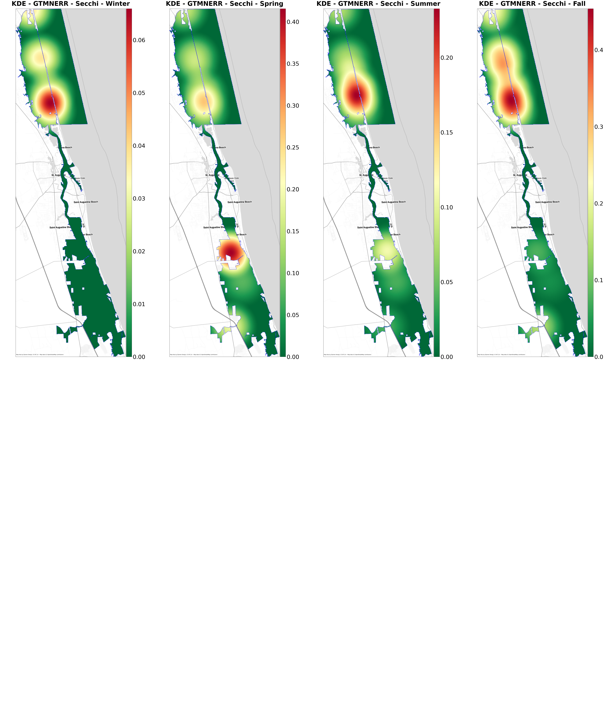
    


    ——————————————————————————————————————————————— Total Nitrogen ———————————————————————————————————————————————
    


    

    


    ————————————————————————————————————————————————— Turbidity ——————————————————————————————————————————————————
    


    
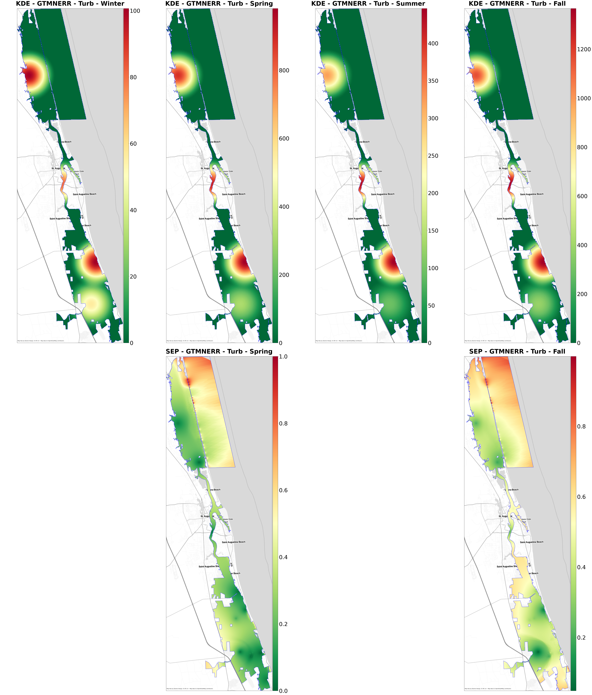
    

